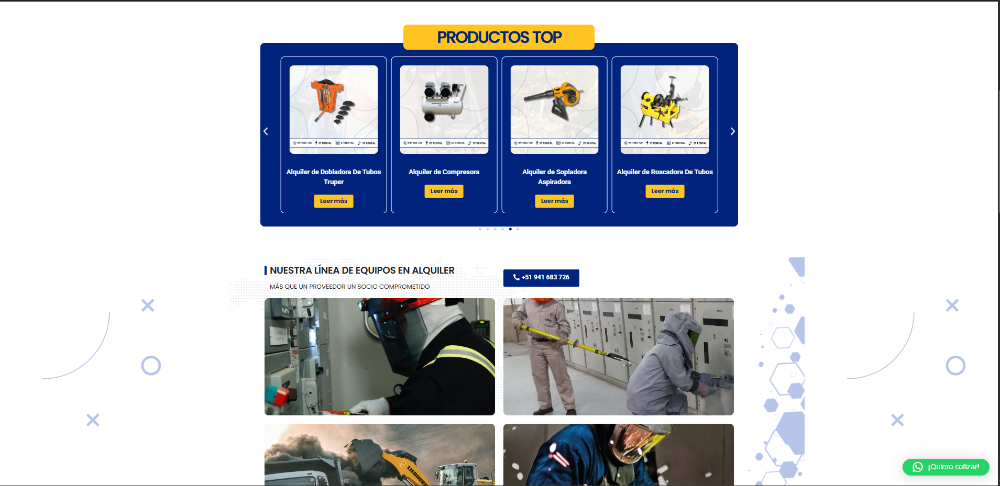
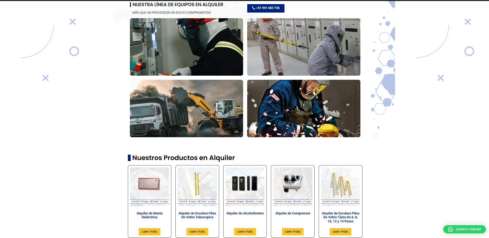
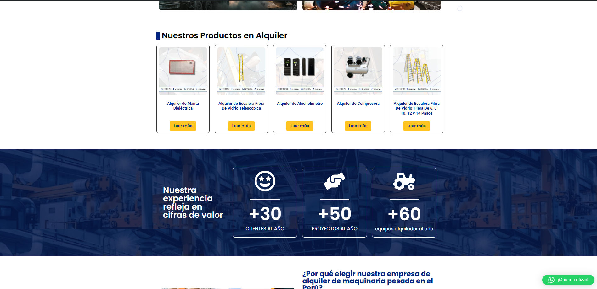
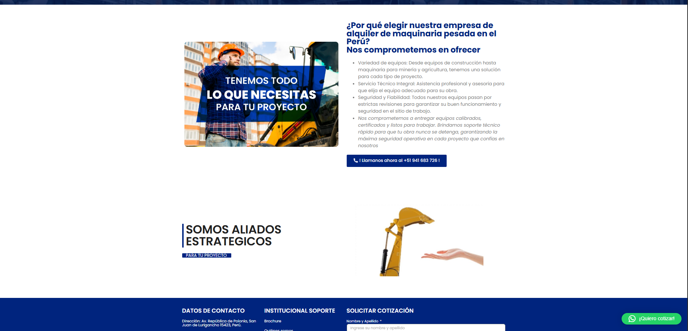

# E-commerce de Productos de Ingeniería Eléctrica (Proyecto Universitario)

Proyecto de curso: tienda en línea (venta con stock) de productos de ingeniería
eléctrica, construida en WordPress + WooCommerce. Está inspirado en el sitio
real de alquiler de **ST Energy** (`strental.com.pe`), pero adaptado al
requisito del curso: en vez de alquiler, este proyecto maneja **venta con
inventario/stock**.

## Estado actual

✅ **Entrega 1 — Landing page** (esta entrega)
🔲 Entrega 2 — Catálogo de productos con stock
🔲 Entrega 3 — Carrito de compras
🔲 Entrega 4 — Checkout / pasarela de pago
🔲 Entrega 5 — Panel de administración de pedidos e inventario

Detalle de alcance de cada entrega en [`docs/entregas.md`](docs/entregas.md).

## Vista previa de la landing (Entrega 1)








Estas son capturas reales de la página funcionando (no un mockup). El
contenido y la estructura de Elementor detrás de esta página están en
[`content/entrega-1-landing/`](content/entrega-1-landing/), junto con un
catálogo de ejemplo para WooCommerce
(`productos-woocommerce-ejemplo.csv`) en modalidad de venta con stock.

## Qué NO va en este repositorio

- **Código de plugins de terceros**, ni gratis ni de pago (Elementor,
  Elementor Pro, WooCommerce, etc.) — se documentan como dependencias en
  [`content/dependencias.md`](content/dependencias.md), no se vendorizan.
  En especial, **Elementor Pro** es de pago y su licencia no permite
  redistribuir su código fuente.
- **Datos comerciales reales** de ST Energy (proveedores, precios de
  alquiler reales, clientes, pedidos). El catálogo de ejemplo usa
  productos y precios ficticios, en modalidad de venta (no alquiler).
- **`wp-config.php`** ni ninguna credencial de base de datos.
- Backups completos (`.wpress`, `.zip`) — se sube el contenido ya extraído
  y revisado, no el backup crudo.

## Estructura

```text
stenergy-ecommerce-universidad/
├── README.md
├── docs/
│   └── entregas.md                        # alcance de cada entrega + cómo se genera el contenido
└── content/
    ├── dependencias.md                    # tema y plugins usados, sin vendorizar código
    └── entrega-1-landing/
        ├── README.md                      # qué es este contenido y qué le falta
        ├── homepage.sql                   # wp_posts/wp_postmeta reales de la home
        ├── productos-woocommerce-ejemplo.csv  # catálogo de ejemplo (Products > Import)
        └── screenshots/                   # capturas de la landing real en vivo
```
